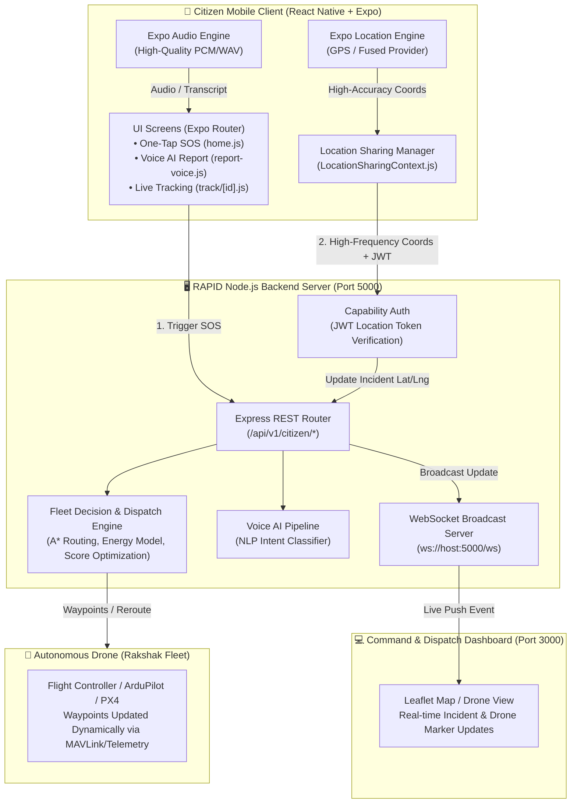
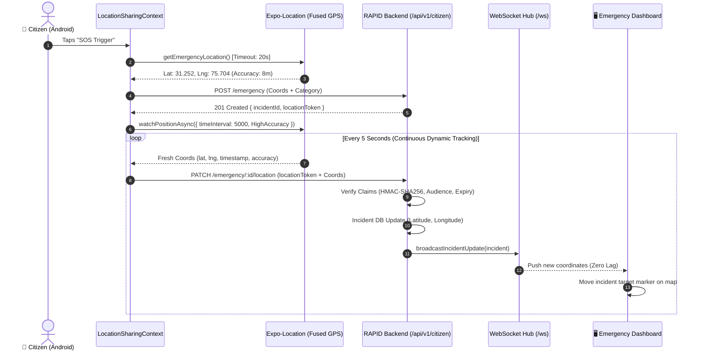
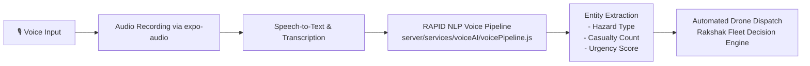
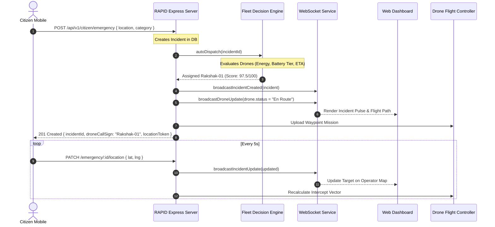

# 📱 RAPID Citizen Mobile App — SIH Pitch & Technical Architecture Guide

> **Project Name:** RAPID (Responsive Autonomous Patrol & Incident Drone)  
> **Component:** `/mobile` — Citizen Emergency & Live Telemetry Tracking Mobile Application  
> **Target Audience:** Smart India Hackathon (SIH) Technical Judges & Evaluators  

---

## 📑 Table of Contents
1. [Executive Summary & Problem Statement](#1-executive-summary--problem-statement)
2. [High-Level System Architecture](#2-high-level-system-architecture)
3. [Technology Stack & Why Each Tool Was Chosen](#3-technology-stack--why-each-tool-was-chosen)
4. [Real-Time Location Sharing — Deep Dive](#4-real-time-location-sharing--deep-dive)
5. [WebSockets vs. HTTP REST: Where, Why & Architectural Decisions](#5-websockets-vs-http-rest-where-why--architectural-decisions)
6. [Voice AI & Emergency Incident Classification](#6-voice-ai--emergency-incident-classification)
7. [End-to-End System Data Flowcharts](#7-end-to-end-system-data-flowcharts)
8. [Failure Tolerance, Edge-Case Handling & Privacy](#8-failure-tolerance-edge-case-handling--privacy)
9. [SIH Judge Q&A Cheat Sheet (Ready Answers)](#9-sih-judge-qa-cheat-sheet-ready-answers)

---

## 1. Executive Summary & Problem Statement

### The Problem in Emergency Response
In traditional emergency services (112 / ambulance / police):
1. **Victims are often panicked or in motion** (running away from fire, danger, or accident scenes). Initial static GPS coordinates quickly become stale.
2. **First responders / drones waste crucial golden minutes** searching the initial dispatch point while the victim has moved 200–500 meters away.
3. **Emergency calls suffer from caller panic**: Describing locations and incident types vocally can take several minutes.

### The RAPID Citizen Solution
RAPID Citizen is a lightweight, zero-latency emergency response companion app built with **React Native & Expo**:
- **One-Tap SOS Dispatch:** Instant GPS lock with automated dispatch of the nearest autonomous patrol drone (*Rakshak*).
- **Dynamic Live Location Streaming:** Continuously streams real-time mobile coordinates so the en-route drone and command center track moving victims dynamically.
- **On-Device & Edge Voice AI:** Natural language audio reporting that classifies emergency severity and extracts critical entities.
- **Live Mission Tracking:** Dynamic visual stepper showing dispatch status, responder callsign, and distance-adjusted real-time ETA.

---

## 2. High-Level System Architecture

---

## 3. Technology Stack & Why Each Tool Was Chosen

| Layer / Technology | Choice | Why We Used It (SIH Defense Rationale) | Where It Is Used |
| :--- | :--- | :--- | :--- |
| **Framework** | **React Native (0.86)** with **Expo (v57)** | Cross-platform compatibility (Android + iOS) from a single codebase. Expo enables native hardware access (GPS, Mic, Foreground services) without writing separate Java/Kotlin/Swift native bridges. | Entire `/mobile` directory |
| **Routing Engine** | **Expo Router (v57)** | File-based typed routing (similar to Next.js). Eliminates boilerplate stack navigators and simplifies deep-linking into specific incident track pages (`/track/[id]`). | `mobile/app/*` |
| **GPS / Geolocation** | `expo-location` | Directly interfaces with Android's Fused Location Provider. Supports foreground location watching with configurable `timeInterval` and `distanceInterval`. | `LocationSharingContext.js` |
| **Audio Pipeline** | `expo-audio` | High-quality audio recording with low resource footprint for voice distress calls. | `mobile/app/report-voice.js` |
| **Local State & Storage** | React Context + `AsyncStorage` | Lightweight state machine without heavy Redux boilerplate. Keeps emergency tokens and profile data persisted across app reloads. | `AuthContext.js`, `LocationSharingContext.js` |
| **Security & Capabilities** | **Dual-Tier JWT Token** | Prevents unauthorized spoofing of victim locations. The incident ID is public for tracking, but only the caller holds the cryptographic capability `locationToken`. | `LocationSharingContext.js` & `citizen.js` |
| **Live Dispatch Sync** | **WebSockets (`ws`)** | Sub-10ms event-driven push to the control room dashboard whenever a drone moves or an incident coordinate shifts. | `server/src/services/websocketService.js` |

---

## 4. Real-Time Location Sharing — Deep Dive

### The Challenge of Live Location in Emergencies
In a real disaster or panic situation:
1. Battery and network connectivity are unstable.
2. GPS drift can produce erratic readings indoors.
3. Queueing old HTTP packets over poor 4G/5G connections causes "lagged coordinate bursts."

### Our Implementation Architecture (`LocationSharingContext.js`)

### Key Technical Safeguards Implemented:
1. **Serial Request Lock (`busy` guard):** If network latency exceeds 5 seconds, the app does not pile up pending requests. Old fixes are discarded in favor of the newest timestamp.
2. **Freshness Verification:** The backend strictly checks `location.timestamp > Date.now() - 60000`. Stale, delayed, or replayed coordinates are rejected immediately.
3. **Cryptographic Capability Token (`locationToken`):**
   - The public incident ID (`OCAE10EB`) is shareable with family.
   - However, **only the reporter's phone** holds the signed JWT token (`audience: citizen-location-update`). No outside attacker can spoof or divert the victim's location.
4. **Lifecycle & App State Awareness:** Uses React Native's `AppState`. Automatically pauses background battery drain and resumes instantly when returned to the foreground.

---

## 5. WebSockets vs. HTTP REST: Where, Why & Architectural Decisions

A common question from hackathon judges is:
> *"Why did you use HTTP REST for the mobile app, but WebSockets for the server-dashboard link?"*

### Architectural Breakdown:

| Metric / Scenario | Mobile App → Server (HTTP PATCH with Serial Polling) | Server → Dashboard & Drone (WebSocket Broadcast) |
| :--- | :--- | :--- |
| **Protocol** | **HTTP/1.1 REST (`PATCH`)** | **Persistent WebSocket (`ws://`)** |
| **Direction** | Client $\to$ Server (Unidirectional Sensor Data) | Server $\to$ Multiple Control Room Operators (Fan-out 1-to-N) |
| **Connection Stability** | Tolerant of intermittent cellular signal drops; each GPS fix is an atomic idempotent operation. | Fixed station with high-bandwidth stable broadband. |
| **Battery Impact** | **Low:** No active socket heartbeat keeping radio hardware energized continuously. | **N/A:** Runs on workstation/laptop browsers. |
| **Security Layer** | Ephemeral Signed JWT Bearer tokens per payload. | Tokenized connection upgrade header. |

> **SIH Judge Pitch Point:**  
> *"We specifically avoided full-duplex persistent WebSockets on the mobile device because mobile cellular radios drop TCP sockets when moving between cellular towers. Using idempotent HTTP PATCH requests with JWT validation guarantees atomic updates without socket reconnection storms, while the control center uses WebSockets for instantaneous real-time visualization."*

---

## 6. Voice AI & Emergency Incident Classification

Victims under severe duress can tap **"Voice Emergency"** (`report-voice.js`):

1. **Extraction:** Classifies severity (`critical`, `high`, `moderate`) and assigns categorization (`medical`, `fire`, `security`, `hazard`).
2. **Autonomous Dispatch:** The Fleet Decision Engine immediately evaluates all available *Rakshak* drones using:
   $$\text{Suitability Score} = w_1 \cdot \text{Distance} + w_2 \cdot \text{Battery Margin} + w_3 \cdot \text{Wind/Payload Feasibility}$$
3. **Mission Assignment:** The highest-scoring drone is dispatched automatically, and the mobile screen receives the assigned drone callsign (e.g., `Rakshak-PB-17`) and dynamic ETA.

---

## 7. End-to-End System Data Flowcharts

### SOS Trigger to Live Drone Dispatch Flow

---

## 8. Failure Tolerance, Edge-Case Handling & Privacy

| Edge Case / Failure | How the RAPID System Handles It |
| :--- | :--- |
| **GPS Unavailable or Indoors** | Rejects stale coordinates; UI displays *"Acquiring GPS / Waiting for fresh GPS"* and retains last confirmed fix without crashing. |
| **App Sent to Background** | Pauses battery-intensive GPS watcher; resumes automatically without losing session state or canceling active SOS. |
| **Cellular Connection Drops** | Serial lock drops failed attempts without backlog accumulation. When connectivity returns, the latest valid fix is transmitted. |
| **Emergency Resolved or Cancelled** | Server returns `HTTP 409 Conflict`. Mobile client terminates GPS loop and displays *"Emergency closed. Sharing ended."* |
| **Data Privacy & Tampering** | No credentials or sensitive medical data travel in cleartext. Coordinate submissions require ephemeral cryptographic signatures. |

---

## 9. SIH Judge Q&A Cheat Sheet (Ready Answers)

### Q1: "Why use React Native instead of native Android (Kotlin) or Flutter?"
> **Answer:** *"React Native with Expo gave us the speed to build a unified codebase for both Android and iOS while allowing deep hardware integration with the Android Fused Location Provider and Audio Recorder. For an emergency ecosystem like RAPID, cross-platform availability is essential—emergency apps cannot exclude users based on their device OS."*

### Q2: "How does your app prevent battery drain during location sharing?"
> **Answer:** *"We use an event-driven lifecycle listener (`AppState`). GPS tracking runs only when an active incident exists and the app is in the foreground. Updates are throttled to optimal 5-second intervals rather than an aggressive 100ms spin, saving battery while keeping accuracy within 5–10 meters."*

### Q3: "What if a hacker intercepts the request and fakes coordinates?"
> **Answer:** *"We implemented capability-based security. While anyone with the incident link can view tracking, only the reporter holds an ephemeral HMAC-SHA256 JWT `locationToken` with audience verification. The backend validates this token, checks coordinate bounding limits, and rejects any timestamp older than 60 seconds."*

### Q4: "How does the mobile app communicate with the drone directly?"
> **Answer:** *"The mobile app does not talk directly to the drone over peer-to-peer Wi-Fi or Bluetooth because emergency drones operate at distances of 5 to 15 kilometers. The mobile app streams live coordinates to our RAPID Command Server, which calculates intercept vectors and sends telemetry waypoints to the drone's flight controller over 4G/telemetry links."*

---

*Compiled for the RAPID Project Team — Smart India Hackathon (SIH)*
